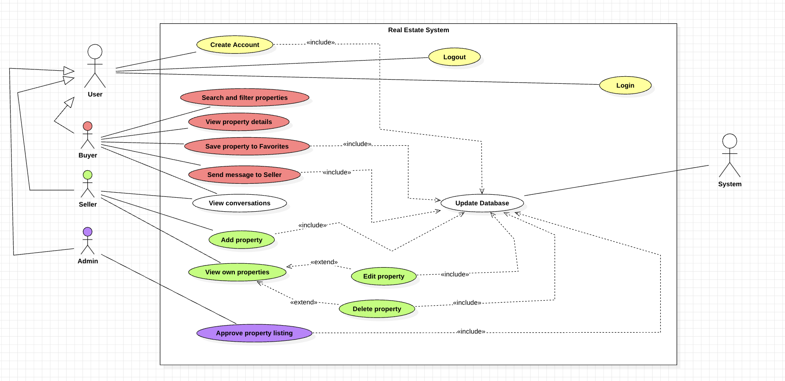
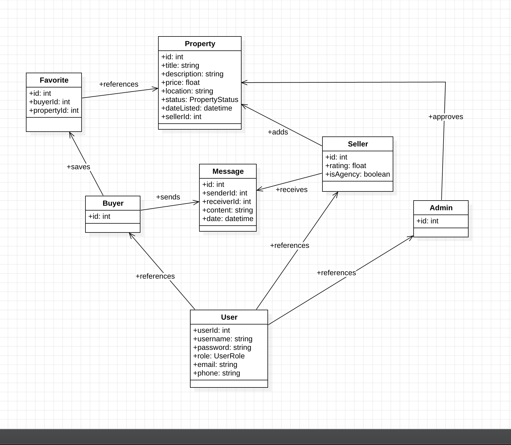

# Real Estate System

A web-based real estate platform built with **Java, Spring Boot, Spring Security, Thymeleaf, PostgreSQL, HTML, CSS, and JavaScript**.

The application is designed as a layered system with separate **presentation**, **business logic**, and **data access** layers. It supports multiple user roles and provides the core workflows of a real estate marketplace: property browsing, favorites, messaging, listing management, and administrative approval.

---

## Table of Contents

- [About the Project](#about-the-project)
- [Main Features](#main-features)
- [Actors and Roles](#actors-and-roles)
- [Technology Stack](#technology-stack)
- [Application Architecture](#application-architecture)
- [Database Model](#database-model)
- [Pages Implemented](#pages-implemented)
- [Project Structure](#project-structure)
- [How to Run the Project](#how-to-run-the-project)
- [Authentication and Authorization](#authentication-and-authorization)
- [Diagrams](#use-case-diagram)
- [Future Improvements](#future-improvements)
- [Author](#author)

---

## About the Project

**Real Estate System** is a multi-role real estate platform where users can search for properties, save favorites, send messages, and manage property listings based on their role.

The system includes three main roles:

- **Buyer** – searches and saves properties, contacts sellers
- **Seller** – adds and manages property listings
- **Admin** – reviews and approves seller listings

This project was developed as an MVP with the intention of being extended into a more complete online real estate platform.

---

## Main Features

### Public Features
- Create account
- Login / Logout
- Search and filter properties
- View property details

### Buyer Features
- Save property to favorites
- View saved favorites
- Send messages to sellers
- View conversations

### Seller Features
- Add property
- View own properties
- Edit property
- Delete property
- View conversations with buyers
- Seller dashboard

### Admin Features
- View pending property listings
- Approve property listings
- Reject property listings
- Admin dashboard

---

## Actors and Roles

### User
Base actor that can:
- create account
- login
- logout

### Buyer
Can:
- search and filter properties
- view property details
- save properties to favorites
- send messages to sellers
- view conversations

### Seller
Can:
- add property listings
- view own properties
- edit property listings
- delete property listings
- view conversations with buyers

### Admin
Can:
- approve property listings
- reject property listings
- monitor pending submissions

---

## Technology Stack

### Backend
- Java
- Spring Boot
- Spring MVC
- Spring Security
- Spring Data JPA
- Hibernate

### Frontend
- Thymeleaf
- HTML5
- CSS3
- JavaScript

### Database
- PostgreSQL

### Build Tool
- Gradle

### Other Libraries
- Lombok
- Jakarta Validation

---

## Application Architecture

The application follows a **layered architecture**:

### 1. Presentation Layer
Responsible for:
- controllers
- HTML pages
- user interaction

### 2. Business Logic Layer
Responsible for:
- validation
- domain rules
- service logic
- role-based actions

### 3. Data Access Layer
Responsible for:
- persistence
- repositories
- communication with PostgreSQL through JPA/Hibernate

---

## Database Model

The application currently uses the following main entities:

- `User`
- `Property`
- `Favorite`
- `Message`

### Enums
- `UserRole`
- `PropertyStatus`
- `SellerType` *(optional / expandable)*

### Main Relationships
- A **seller** can own multiple properties
- A **buyer** can save multiple favorite properties
- A **buyer** and a **seller** can exchange messages
- An **admin** can approve or reject property listings through property status updates

---

## Pages Implemented

### Public Pages
- `/` → Landing page
- `/login` → Login page
- `/register` → Register page
- `/properties` → Search properties
- `/properties/{id}` → Property details

### Buyer Pages
- `/buyer` → Buyer dashboard
- `/buyer/favorites` → Favorites
- `/buyer/messages` → Messages and conversations

### Seller Pages
- `/seller` → Seller dashboard
- `/seller/properties` → My properties
- `/seller/properties/add` → Add property
- `/seller/properties/edit/{id}` → Edit property
- `/seller/messages` → Messages and conversations

### Admin Pages
- `/admin` → Admin dashboard
- `/admin/properties/pending` → Pending approvals

---

## Project Structure

```text
src/
 ├── main/
 │   ├── java/ro/andramates/realestate/
 │   │   ├── config/
 │   │   ├── controller/
 │   │   ├── domain/
 │   │   ├── dto/
 │   │   ├── repository/
 │   │   ├── service/
 │   │   └── RealEstateApplication.java
 │   │
 │   └── resources/
 │       ├── static/
 │       │   ├── css/
 │       │   ├── js/
 │       │   └── images/
 │       ├── templates/
 │       │   ├── auth/
 │       │   ├── property/
 │       │   ├── message/
 │       │   ├── seller/
 │       │   ├── buyer/
 │       │   └── admin/
 │       └── application.properties
```

## How to Run the Project
### Requirements
- Java 21
- PostgreSQL
- Gradle
- IDE such as IntelliJ IDEA
### 1. Clone the repository
```bash
   git clone <your-repository-url>
   cd real-estate
```
### 2. Create the PostgreSQL database

Example:
```sql
CREATE DATABASE real-estate;
```
### 3. Configure application.properties

Example:

```
spring.datasource.url=jdbc:postgresql://localhost:5432/realestate_db
spring.datasource.username=postgres
spring.datasource.password=your_password

spring.jpa.hibernate.ddl-auto=update
spring.jpa.show-sql=true
spring.thymeleaf.cache=false
server.port=8080
```
### 4. Run the application

#### Using Gradle:
```
./gradlew bootRun
```
Or run the main Spring Boot class directly from IntelliJ.

### 5. Open in browser
```
   http://localhost:8080
  ```

## Authentication and Authorization

Authentication is implemented with Spring Security.

### Supported login methods
- username
- email
### Roles
- BUYER
- SELLER
- ADMIN
## Use Case Diagram



## Class Diagram




## Future Improvements

- property image upload
- advanced filtering by price, city, and type
- conversation grouping and chat-style interface
- property comparison
- map integration

## Author

Andra Mates